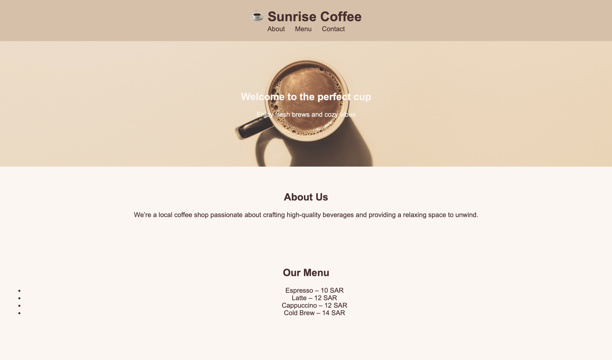

# ☕ Sunrise Coffee – Simple Website

This is a simple and responsive website for a fictional coffee shop named **Sunrise Coffee**.  

---

## 📌 Project Description

The website includes:
- A welcoming homepage with background image
- "About Us" section introducing the coffee shop
- "Menu" section with coffee items and prices
- "Contact" section with email and location

---

## 🛠️ Technologies Used

- HTML5  
- CSS3  
- (Optional) Responsive design using simple CSS

---

## 📂 Project Structure

```
📁 sunrise-coffee/
├── index.html
├── style.css
├── assets/
│   ├── coffee1.jpg
│   └── screenshot.jpg
└── README.md
```

---

## 🖥️ How to Run Locally

1. Clone or download the repository:

```bash
git clone https://github.com/RaghadOs/sunrise-coffee.git
```

2. Open the project folder.  
3. Open the file `index.html` in your browser.

---

## 🔗 Live Demo

You can view the website live here:  
👉 [sunrise-coffee.github.io](https://RaghadOs.github.io/sunrise-coffee/)

---

## 📸 Website Preview


